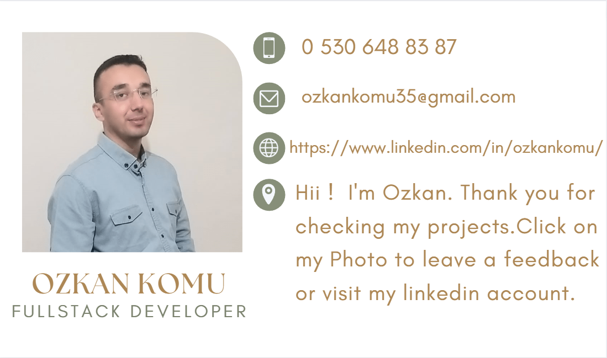

<p align="left">
<a href="https://www.linkedin.com/in/ozkankomu/" target="_blank"></a>
</p>


# Project : Recapt Website

## Table of contents

  - [The challenge](#the-challenge)
  - [Screenshot](#screenshot)
  - [Project Skeleton ](#project-skeleton)
  - [Links](#links)
  - [Built with](#built-with)
  - [Useful resources](#useful-resources)
- [Author](#author)


## The challenge
Project aims to create a Recapt webpage for Css.

## Problem Statement

- I wanted to build Recapt webpage includes CSS properties So I have started to work on the project.
<hr>


## Project Skeleton 

```
Recapt-webpage(folder)

|----README.md                   
|----images      
     | photos...
|----index.html  
|----style.css   
|----images
```

## Screenshot

<a href="https://ozkankomu.github.io/CSS_Recapt_Project/"></a>

## Links
<hr>
<b>Check The Live Website ➡️</b> <a href="https://ozkankomu.github.io/CSS_Recapt_Project/">Live Website</a>
<hr>

### Built with

- Semantic HTML5 markup
- CSS custom properties
- Flexbox
- CSS Grid
- Box / text Shadow

- [Styled Components](https://styled-components.com/) - For styles
	
- HTML Forms-Input Types 

- HTML Form Elements

- CSS Colors-Border Properties

- CSS Margins-Padding

- CSS Properties for Texts-Font Families-Links


-

## Notes

- You can use HTML,and CSS to complete this project.

### Useful resources

- [W3 Schoold](https://www.w3schools.com/) - This helped me for basics of website paradigm. I really liked this pattern and will use it going forward.
- [MDN](https://developer.mozilla.org/en-US/) - This is an amazing document which helped me finally understand deep sides of web development. I'd recommend it to anyone still learning these concepts.


## Author

- Author - [Ozkan]

<center> &#8987; Happy Coding  &#9997; </center>
